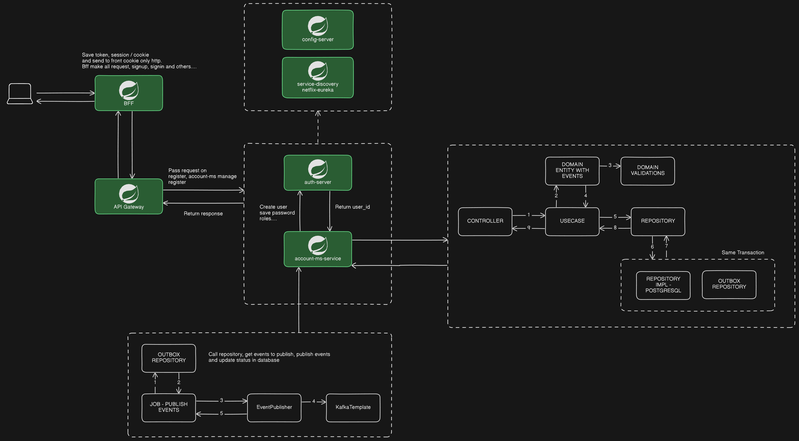

# Documentação

- Arquitetura
  - Usamos o padrão de arquitetura de microserviços, onde cada serviço é responsável por uma parte do sistema.
  - Cada serviço é independente e possui sua própria base de dados.
  - A comunicação entre os serviços é feita através de chamadas HTTP ou via mensageria.
  - Utilizamos o padrão de API Gateway para centralizar as chamadas dos clientes.
  - Utilizamos o padrão de Service Discovery para que os serviços possam se descobrir.
  - Cada serviço utiliza o padrão de autenticação OAUTH2 para garantir a segurança das chamadas.
  - Cada serviço utiliza o padrão clean architecture para garantir a separação de responsabilidades.

- Imagem da arquitetura

- Swagger
  - Cada serviço possui sua documentação em swagger, para acessar a documentação basta acessar a url do serviço e adicionar `/swagger-ui.html` no final.
  - Exemplo: `http://localhost:8080/api/swagger-ui/index.html`